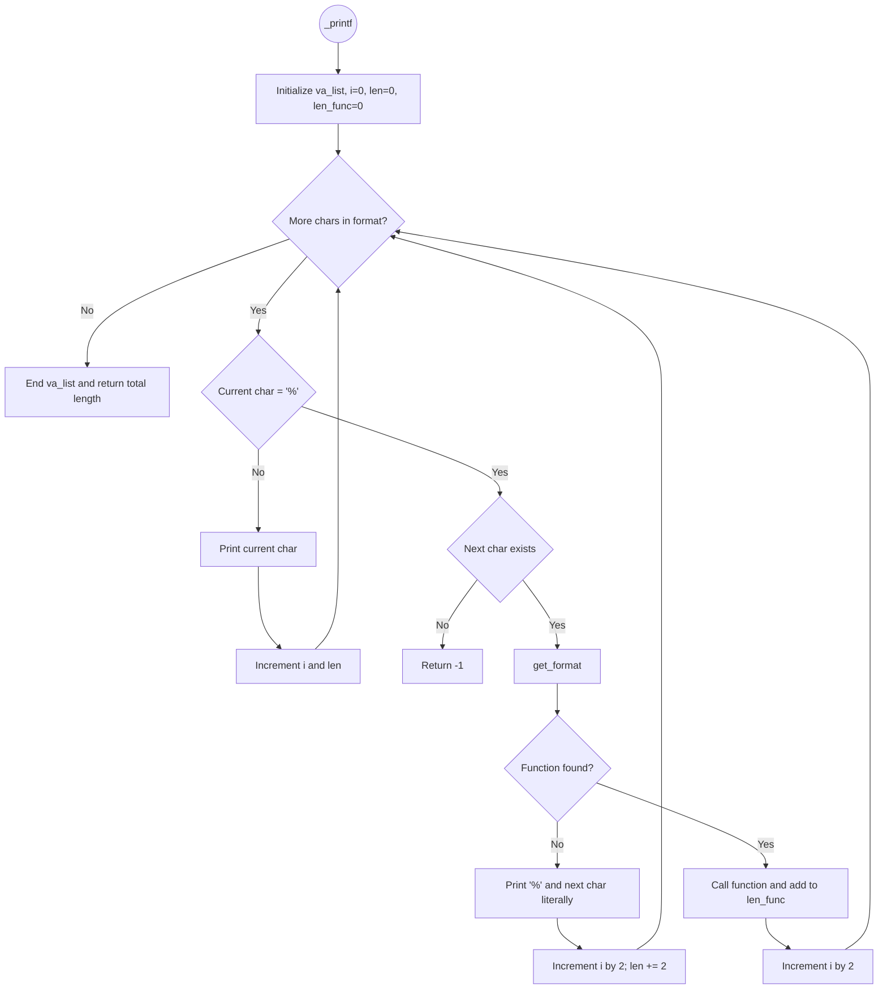

# \_printf project - Holberton School C#25 :exclamation:

## Description :pushpin:

This project contains all the necessary files to compile `_printf`, inspired by the real `printf` available in the `<stdio.h>` library. It is a function that formats and prints data.

## Compilation Command and Requirement :computer:

The project is compiled with `-Wall -Werror -Wextra -pedantic -std=gnu89` to enforce strict code quality and catch warnings as errors and all the files will be compiled on Ubuntu 20.04 LTS

## Betty Style :black_nib:
All the files are written with the [Betty coding style](https://www.holbertonschool.fr/post/quest-ce-que-la-regle-betty-dans-le-langage-de-programmation-c)

## Repository files list :newspaper:
| File name          | % | Description                                                                  |
| -----------------: | :--: | ---------------------------------------------------------------------------- |
| [_printf.c](https://github.com/tomvieilledent/holbertonschool-printf/blob/main/_printf.c)          |      | Contains the main function `_printf()`                                       |
| [get_format.c](https://github.com/tomvieilledent/holbertonschool-printf/blob/main/get_format.c)     |      | `get_format()` checks \*format and calls the function needed |
| [printf_c.c](https://github.com/tomvieilledent/holbertonschool-printf/blob/main/printf_c.c)       | %c |  Contains `printf_c()` that prints a character                   |
| [printf_s.c](https://github.com/tomvieilledent/holbertonschool-printf/blob/main/printf_s.c)     | %s | Contains `printf_s()`that prints a string
[printf_d.c](https://github.com/tomvieilledent/holbertonschool-printf/blob/main/printf_d.c)     | %d %i | Contains `printf_d()`that prints an integer                     |
| [printf_37.c](https://github.com/tomvieilledent/holbertonschool-printf/blob/main/printf_37.c)         | %% | Contains `printf_37()`that printf '%'                              |
| [main.h](https://github.com/tomvieilledent/holbertonschool-printf/blob/main/main.h)             |      | Contains all the headers, prototypes and structure needed                    |
| [man_3_printf](https://github.com/tomvieilledent/holbertonschool-printf/blob/main/man_3_printf)       |      | This is the man page of our _printf                                          |
| [_putchar.c](https://github.com/tomvieilledent/holbertonschool-printf/blob/main/_putchar.c)         |      | Contains our own puchar command permitting to print a character              |
| [flowchart](https://github.com/tomvieilledent/holbertonschool-printf/tree/main/flowchart)         |      | Contains all function's flowchart

## Flowchart :ocean:

Here is the flowchart that we followed during the development of our _printf function:

## How to use \_printf  :question:

`
_printf(FORMAT, ARGUMENTS)
`
To print formated data, use different specifiers in your FORMAT to print:

 - `%c`: to print a char
 - `%s`: to print a string
 - `%%`: to print the character '%'
 - `%i`or `%d`: to print a int base 10
 - `%b`: to print in binary
 
## Exemples :exclamation:

#include "main.h"

int main(void)
{
    int num1 = 42;
    int num2 = -123;
    char c = 'A';
    char *str = "Hello";
    unsigned int bin = 10;

    _printf("Integer i: %i\n", num1);
    _printf("Integer d: %d\n", num2);
    _printf("String s: %s\n", str);
    _printf("Char c: %c\n", c);
    _printf("Percent %% sign\n");
    _printf("Binary b: %b\n", bin);

    return 0;
}

**STDOUT**

Integer i: 42
Integer d: -123
String s: Hello
Char c: A
Percent % sign
Binary b: 1010
## Project Authors :dancers:
- [MOUYSSET Alexandre](https://github.com/alexandre-mouysset)
- [VIEILLEDENT Tom](https://github.com/tomvieilledent)