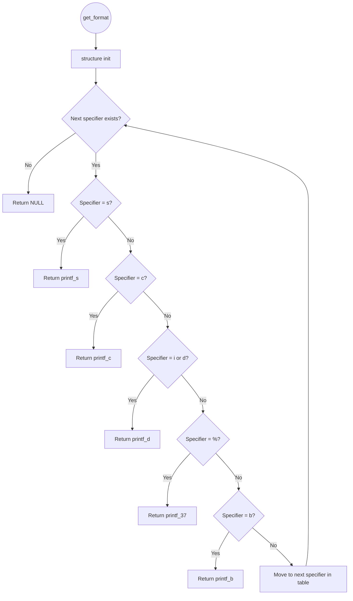

```mermaid
flowchart TD
    Start((get_format)) --> Init[structure init]
    Init --> CheckNext{Next specifier exists?}
    CheckNext -->|No| ReturnNull[Return NULL]
    CheckNext -->|Yes| Specifier_s{Specifier = s?}
    Specifier_s -->|Yes| Click_s[Return printf_s]
    click Click_s "https://github.com/tomvieilledent/holbertonschool-printf/blob/main/flowchart/printf_s.md" "Flowchart printf_s"
    
    Specifier_s -->|No| Specifier_c{Specifier = c?}
    Specifier_c -->|Yes| Click_c[Return printf_c]
    click Click_c "https://github.com/tomvieilledent/holbertonschool-printf/blob/main/flowchart/printf_c.md" "Flowchart printf_c"
    
    Specifier_c -->|No| Specifier_id{Specifier = i or d?}
    Specifier_id -->|Yes| Click_id[Return printf_d]
    click Click_id "https://github.com/tomvieilledent/holbertonschool-printf/blob/main/flowchart/printf_d.md" "Flowchart printf_d"
    
    Specifier_id -->|No| Specifier_percent{Specifier = %?}
    Specifier_percent -->|Yes| Click_percent[Return printf_37]
    click Click_percent "https://github.com/tomvieilledent/holbertonschool-printf/blob/main/flowchart/printf_37.md" "Flowchart printf_37"
    
    Specifier_percent -->|No| Specifier_b{Specifier = b?}
    Specifier_b -->|Yes| Click_b[Return printf_b]
    click Click_b "https://github.com/tomvieilledent/holbertonschool-printf/blob/main/flowchart/printf_b.md" "Flowchart printf_b"
    
    Specifier_b -->|No| Next[Move to next specifier in table]
    Next --> CheckNext

```