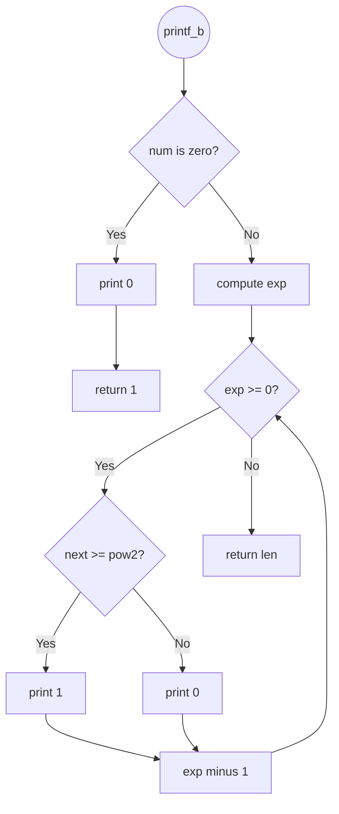

```mermaid
flowchart TD
    start_b((printf_b)) --> zero_b{num is zero?}
    zero_b -->|Yes| print0_b[print 0]
    print0_b --> ret1_b[return 1]
    zero_b -->|No| expcalc_b[compute exp]
    expcalc_b --> loop_b{exp >= 0?}
    loop_b -->|Yes| powcheck_b{next >= pow2?}
    powcheck_b -->|Yes| print1_b[print 1]
    powcheck_b -->|No| print0_b2[print 0]
    print1_b --> dec_b[exp minus 1]
    print0_b2 --> dec_b
    dec_b --> loop_b
    loop_b -->|No| retlen_b[return len]
```