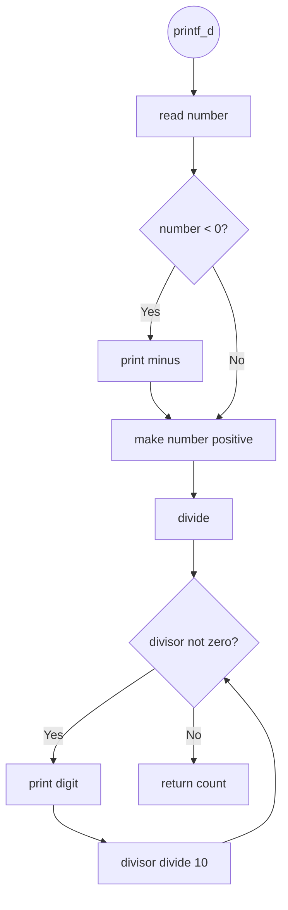

```mermaid
flowchart TD
    start((printf_d)) --> read[read number]
    read --> negative{number < 0?}
    negative -->|Yes| print_minus[print minus]
    print_minus --> positive[make number positive]
    negative -->|No| positive
    positive --> division[divide]
    division --> loop{divisor not zero?}
    loop -->|Yes| print_digit[print digit]
    print_digit --> divideresult[divisor divide 10]
    divideresult --> loop
    loop -->|No| return[return count]
```