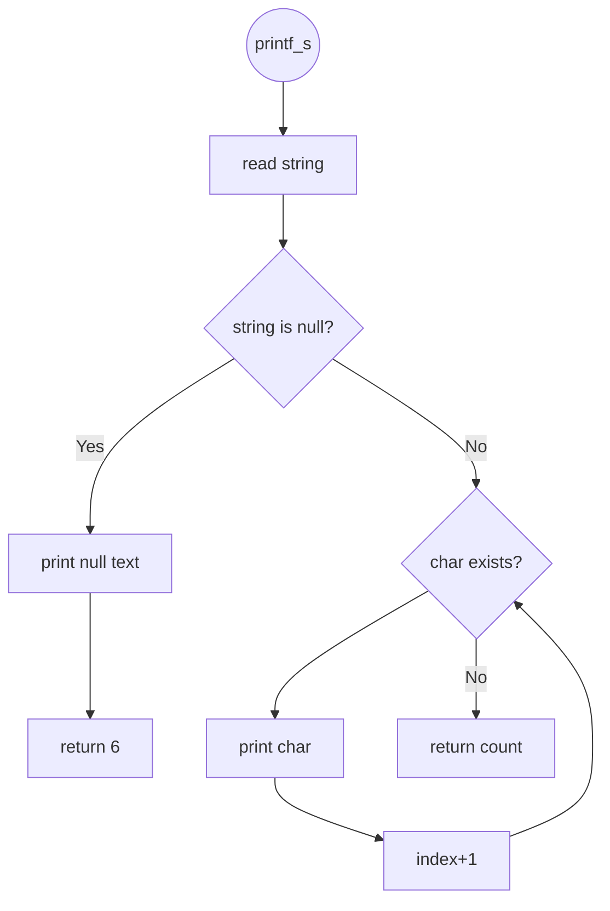

```mermaid
flowchart TD
    start((printf_s)) --> readstring[read string]
    readstring --> null{string is null?}
    null -->|Yes| printnull[print null text]
    printnull --> return6[return 6]
    null -->|No| loop{char exists?}
    loop --> printstring[print char]
    printstring --> increasestring[index+1]
    increasestring --> loop
    loop -->|No| return[return count]
```